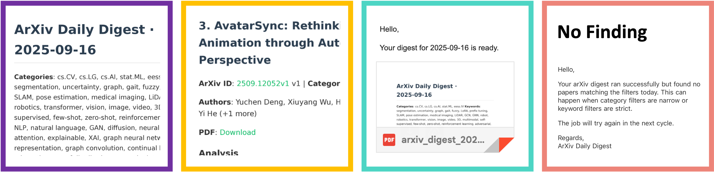

# ArXivDailyDigest

**ArXiv Daily Digest** by **Vibe Coding** is an automated system for discovering, scoring, and delivering daily research updates with LLM support. I’ve modified the original version to improve usability by separating the configuration into its own module and refining several internal workflows. The system fetches the latest arXiv papers, filters them based on the user’s selected interests, scores them using a large language model, and compiles a clean daily digest in both Markdown and PDF formats. It uses the Gemini API to rank paper relevance. If no paper meets the selection criteria, the user will instead receive a short notification email. The figure below shows an example of the actual output. When running in daemon mode, users can schedule daily delivery at a preferred time and receive both the Markdown and PDF digest by email.


## 🖼️ Screenshot




## 🎯 Scoring Mechanism

This system favors verifiable signals over vague prose. Papers must pass minimum thresholds
for evidence, novelty, and overall score to enter the digest.

🏛️ Author Affiliation (Primary Signal)
    Papers from organizations with a history of highly cited work receive a score bonus.
    The bonus decays over time and has a cap to prevent inflation.

🔬 Experimental Keywords (Secondary Signal)
    Terms like dataset, benchmark, ablation, SOTA, cross-validation add a smaller evidence boost.

🌐 Keyword Diversity Bonus
    More diverse matched keywords raise the score and promote interdisciplinary work.

⚠️ Low-Innovation Words (Penalty)
    Words such as survey, review, comparison, analysis, preliminary reduce the novelty score.

🚩 Red Flags
    Missing experiments, no baselines, or vague claims can reduce the evidence bonus.

✅ Decision Rule
    A paper is included in the digest only if it passes evidence and novelty thresholds and reaches a sufficient overall score.


## ⚙️ Installation & Setup

```
pip install arxiv tenacity pydantic httpx python-dateutil google-genai  markdown weasyprint
```


## 🔑 Environment Variables

### Using the Gemini API

The system leverages the Gemini API to evaluate and rank papers.  
To enable this feature, users must obtain an API key from **Google AI Studio**. You can register and generate your key at [https://aistudio.google.com/](https://aistudio.google.com/).  
After obtaining the key, save it as an environment variable named `GEMINI_API_KEY`. The application will automatically detect and use this key for paper scoring.

```
EMAIL_PASSWORD = your-app-password
GEMINI_API_KEY = your-gemini-key
```
### Linux/macOS
```
echo 'export EMAIL_PASSWORD="your-app-password"' >> ~/.bashrc
echo 'export GEMINI_API_KEY="your-gemini-key"' >> ~/.bashrc
source ~/.bashrc
```
### Windows PowerShell
```
$Env:EMAIL_PASSWORD = "your-app-password"
$Env:GEMINI_API_KEY = "your-gemini-key"
```
### .env File
```
EMAIL_PASSWORD=your-app-password
GEMINI_API_KEY=your-gemini-key
```


## 🚀 Usage

### ▶️ Single Run
```
python arxiv_digest.py
```
### 🔁 Daemon Mode
```
python arxiv_digest.py --daemon
```
### ⏱️ Schedule (config.py)
```
DAEMON_CONFIG = {
    "run_hour": 4,
    "run_minute": 0,
    "run_second": 0,
}
```

### ⚙️ User Configuration (config.py)

All user-editable settings are defined below. You can customize email delivery, scheduling time, timezone, and arXiv search filters. This file controls how the daily ArXiv digest behaves. The scoring mechanism, preferred units, and keyword weightings can also be adjusted here. By default, this config adopts a ChatGPT-5 suggested scoring system, which should be tuned to fit your actual needs.

# Email Settings
```
SENDER_EMAIL_ADDRESS = "MAIL_FROM@XXX.com"
RECIPIENT_EMAIL_ADDRESS = "MAIL_TO@XXX.com"
SENT_EMAIL_ADDRESS = SENDER_EMAIL_ADDRESS  # Optional alias
```

# Local Cache
```
DB_FILE = "seen.db"  # SQLite file for storing fetched paper records
```

# Timezone & Date Range
```
from dateutil.tz import gettz
TZ = gettz("Asia/Taipei")  # Timezone for scheduling and filtering
DAYS_BACK = 2              # Number of days back to fetch new papers
```

# Daily Run Schedule (for daemon mode)
```
DAEMON_CONFIG = {
    "run_hour": 4,
    "run_minute": 0,
    "run_second": 0,
}
```

# ArXiv Search Filters
```
CATEGORIES = ["CATEGORY1", "CATEGORY2", "CATEGORY3"]
KEYWORDS = [
    "KEYWORD1", "KEYWORD2", "KEYWORD3", ...
]
```


## 🛡️ Handling API Errors

The script uses exponential backoff and model fallback to handle common failures such as **429 Too Many Requests**. When a key or service is unavailable, it automatically pauses, retries, or switches to a working provider.


## 🧹 Cache & Cleanup

The system manages caches and outputs to save space.

🗂️ Cache retention: 14 days (configurable in config.py)

📑 Output retention: 30 days (configurable in config.py)

🗃️ Periodic SQLite VACUUM to reclaim storage


## 📡 API Status

🟢 Google AI Studio Status → https://aistudio.google.com/status
